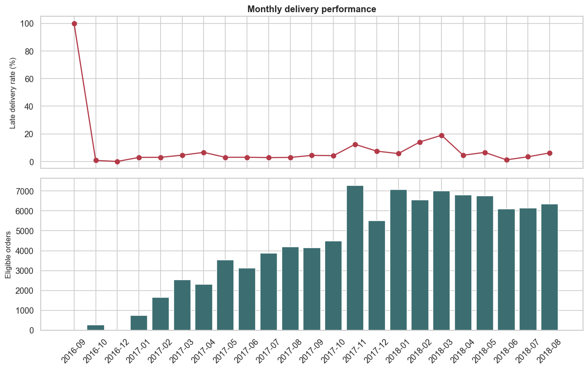
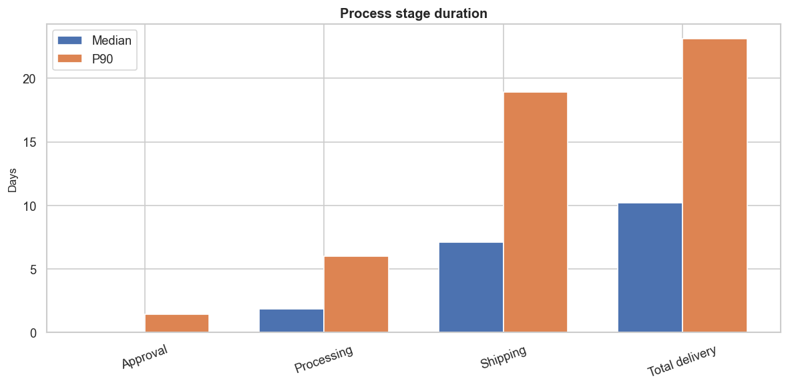
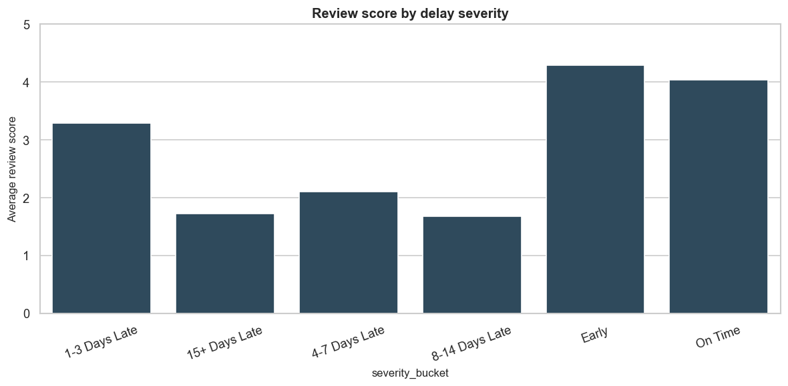
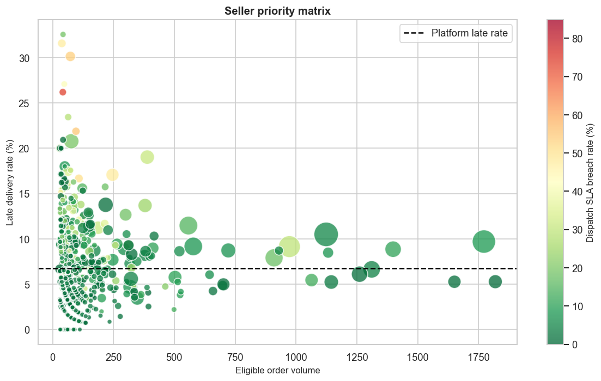
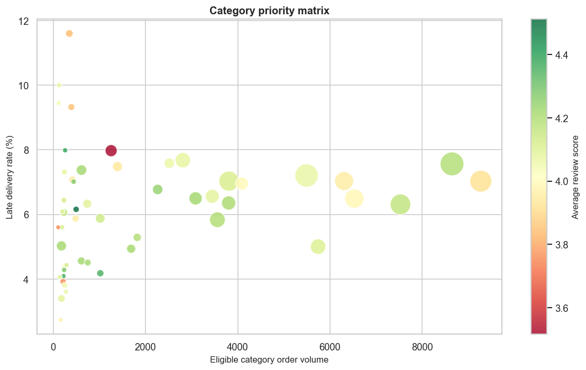
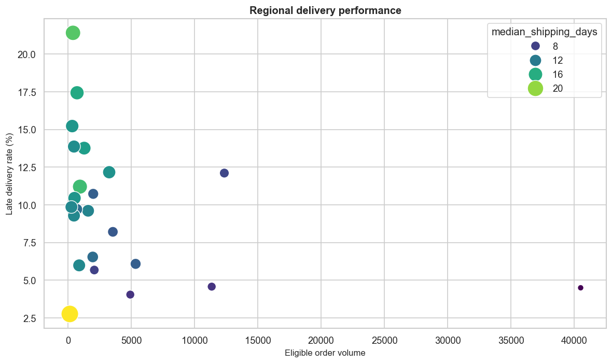

# E-Commerce Delivery Performance & Revenue-at-Risk Analysis

This repository contains a reproducible PostgreSQL and Python analysis of delivery performance, customer review association, and gross order value exposed to late delivery in the Brazilian E-Commerce Public Dataset by Olist.

## Project Overview

The analysis supports the Marketplace Operations Director in deciding which sellers, product categories, customer regions, and order-process stages deserve operational attention.

## Business Problem

Delivery performance is multi-stage and multi-actor. This project separates seller dispatch, customer delivery, customer experience, and value exposure without treating observational associations as causal proof.

## Stakeholders and Decision

Stakeholders include Seller Performance, Customer Experience, Logistics Operations, and Business Intelligence. The decision is how to prioritize operational investigation using volume, rates, process metrics, review evidence, and gross value exposure.

## Dataset

Source: [Brazilian E-Commerce Public Dataset by Olist](https://www.kaggle.com/datasets/olistbr/brazilian-ecommerce). Raw files are local-only and intentionally excluded from Git. See [data/README.md](data/README.md).

## Data Model

`raw` preserves source tables, `staging` provides typed/normalized fields, and `analytics` contains aggregated intermediate models plus separate order, order-seller, and order-item facts. One-to-many sources are aggregated before joining; item-payment multiplication is prevented.

## KPI Definitions

Delivery eligibility, calendar-date early/on-time/late classification, delay severity, gross order value, at-risk order value, review score gap, and dispatch SLA are defined in [docs/metric_dictionary.md](docs/metric_dictionary.md).

## Methodology

See [docs/methodology.md](docs/methodology.md). At-risk order value is exposure, not proven revenue loss or profit loss. Seller involvement does not prove seller causality. Reviews may have selection bias, and estimated-delivery performance can reflect multiple operational actors.

## Data Quality

The pipeline exports `outputs/tables/data_quality_summary.csv`, with critical failures separated from warnings. The validated run found no duplicate core composite keys or invalid review scores; it flagged 547 orders with multiple review records, 8 delivered orders missing a customer-delivery date, and 1,359 negative processing durations for investigation. Historical data, boundary-month completeness, missing delivery dates, review multiplicity, and payment/item reconciliation are explicitly checked.

## Key Findings

The validated run covers 96,470 eligible delivered orders. The late-delivery rate is 6.8%; late orders have BRL 1,150,892.13 of gross order value exposure, equal to 7.5% of eligible gross order value. Average review score is 4.29 for early/on-time orders versus 2.27 for late orders, an observed 2.02-point gap. These are associations and exposure measures, not proof of causality or realized loss. See the generated [executive summary](outputs/summary/executive_summary.md) and [KPI table](outputs/tables/executive_kpis.csv).

## Visual Analysis








## Recommendations

Recommendations are generated from validated scale, customer impact, commercial exposure, and operational addressability. They should be interpreted as investigation priorities, not causal diagnoses.

## Limitations

The data is historical; reviews are not universal; estimated dates and carrier handoff reflect multiple actors; the dataset does not prove root cause; and at-risk value is not confirmed financial damage.

## Repository Structure

See the `sql/`, `src/`, `tests/`, `docs/`, `outputs/`, and `data/` directories. `run_pipeline.py` is the primary entry point.

## How to Run

Create `.env` from `.env.example`, place the required Olist CSVs in `data/raw/`, install `requirements.txt`, ensure PostgreSQL database `olist_delivery_analysis` exists, and run:

```powershell
python run_pipeline.py
pytest -q
```

Stage-specific runs are supported with `--stage load|quality|models|analysis|validate|visualize|summary`.

## Technologies

Python, pandas, NumPy, SQLAlchemy, PostgreSQL, matplotlib, seaborn, pytest, and dotenv.

## Data Source and License

Project code is MIT licensed. The Olist source dataset is not included and remains subject to its original publisher terms.
